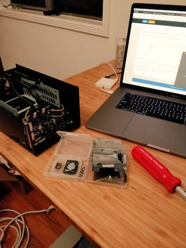

+++
template = "post.html"
title = "ROCKPro64 System, Part 1"

[taxonomies]
tags = ["pine64", "linux"]
categories = ["blog"]
+++

Back in Jan I finally ordered a ROCKPro64. My goal with this system is to create a small quiet 
linux system that I can use to host a Bitcoin full node. I over provisioned it a bit so I can use it 
to self host other (TBD) services in the future. The core hardware I purchased directly from 
[Pine64](https://www.pine64.org/rockpro64/), the parts list is:

| Product                                                         | Quantity |  Price |
|-----------------------------------------------------------------|:--------:|-------:|
| ROCKPro64 4GB Single Board Computer                             | 1        | $79.99 |
| ROCKPro64 2x2 MIMO Dual Band WIFI 802.11AC/BLUETOOTH 4.2 MODULE | 1        | $15.99 |
| ROCKPro64 30mm Tall Profile Heatsink                            | 1        | $3.49  |
| ROCKPro64 Metal Desktop/NAS Casing                              |	1        | $44.99 |
| ROCKPro64 12V 5A US POWER SUPPLY	                              | 1        | $12.99 |
| ROCKPro64 PCI-e to Dual SATA-II Interface Card                  | 1        | $9.99  |
| 64GB CLASS10 MICROSD CARD                                       |	1        | $20.99 |
| 128GB eMMC Module                                               |	1        | $54.95 |
| USB Adapter for eMMC Module                                     | 1        | $4.99  |
| Fan for ROCKPro64 Metal Desktop/NAS casing                      |	1        | $3.99  |

  
I also bought two Samsung SSD drives from [Amazon](https://www.amazon.com/gp/product/B078DPCY3T):
  

| Product                                                                | Quantity |  Price  |
|------------------------------------------------------------------------|:--------:|--------:|
| Samsung SSD 860 EVO 1TB 2.5 Inch SATA III Internal SSD (MZ-76E1T0B/AM) |  2       | $246.22 |

  
Unfortunately half the parts I ordered from Pine64 were mistakenly omitted from my first shipment. Then due to the 
Lunar New Year and the COVID-19 epidemic in China the remaining parts were delayed until just last week. I have to 
commend the Pine64 support team for doing their best in a difficult situation. 

For hardware assembly instructions I used the [RockPro64 wiki page](https://wiki.pine64.org/index.php/ROCKPro64)
and in particular the [NAS Case page](https://wiki.pine64.org/index.php/ROCKPro64#The_NAS_Case_for_the_ROCKPro64). I found
the youtube video ["PINE64 ROCKPro64 NAS Case Getting Started"](https://youtu.be/_UeeklKo0Og) from ameriDroid very helpful.

For the OS install I first installed [Etcher](https://etcher.io/) on my laptop, and then downloaded the 
[Armbian Buster](https://www.armbian.com/rockpro64/) image and loaded it onto my eMMC module using my eMMC USB adapter.
This process was very easy, just select the image, select the empty eMMC removable drive, and go. Once written I 
removed the eMMC from the USB adapter and plugged it into the ROCK64Pro board. Attaching the module to the board is a little 
tricky because it is a very small connector. If I were to do this again I'd install the eMMC and the WiFi boards on the
main ROCKPro64 board before putting the main board it into the NAS case. 

Next I connected my ROCKPro64 to an ethernet switch and plugged in its power supply. I also attached a HDMI monitor and 
USB keyboard. To my surprise the system came right up, first try. On start-up I was prompted to set the root password and
setup my first user account. Next I used the command `ip a` to get the systems DHCP assigned IP address and from then
on was able to access it via SSH. I also setup my `~/.ssh/authorized_keys` so I can ssh to it without a password.

I completed the final setup steps below using the very handy `sudo armbian-config` command:

1. Upgrade the system firmware
1. Configure SSH to disable `root` and `password` login
1. Set my local timezone

When I tried to configure the WiFi interface I got disconnected and had to hard reboot the system. I need to do more 
research to figure out if there's a way to get the WiFi module to work with Linux. I read somewhere that it's currently 
only supported for Android.

